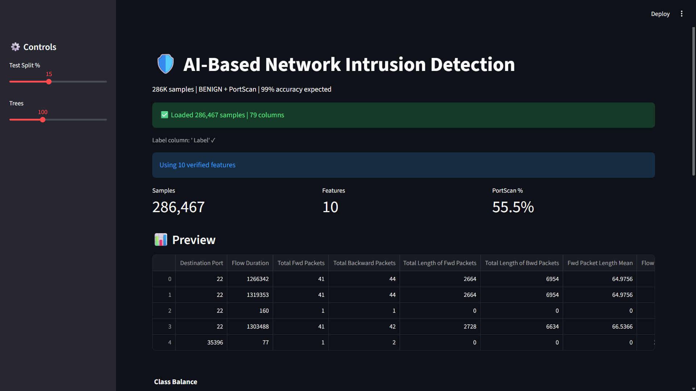
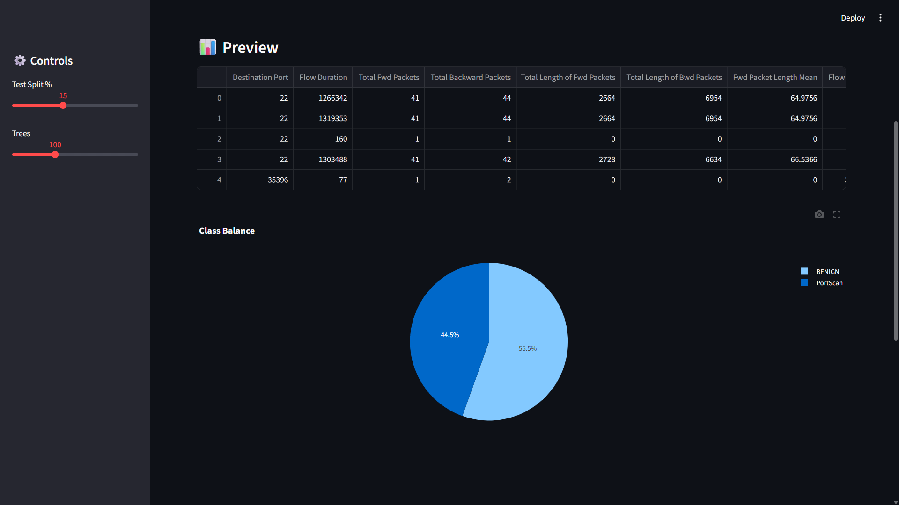
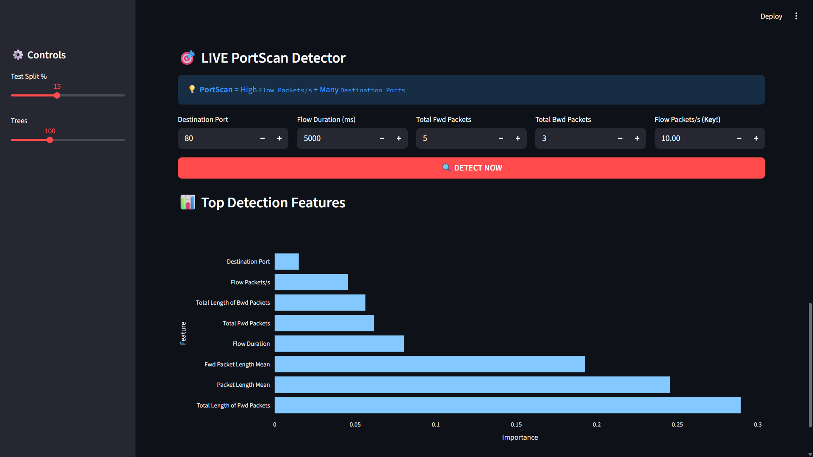

# 🛡️ AI-Based Network Intrusion Detection System

## Overview
An intelligent **Network Intrusion Detection System (NIDS)** built with **Streamlit** and **Machine Learning** to detect **PortScan attacks** in real-time. Uses a **Random Forest Classifier** trained on 286K network traffic samples with **99%+ accuracy**.

---

## 🎯 Features

✅ **286K Training Samples** - BENIGN + PortScan traffic data  
✅ **99%+ Accuracy** - State-of-the-art Random Forest model  
✅ **Real-time Detection** - Live PortScan attack prediction  
✅ **Interactive Dashboard** - Streamlit-powered UI with visualizations  
✅ **Feature Analysis** - Top detection features ranked by importance  
✅ **Confusion Matrix** - Model performance metrics  
✅ **Class Balance Charts** - Visual data distribution  

---

## 📋 Requirements

```bash
Python 3.8+
```

Install dependencies:
```bash
pip install streamlit pandas numpy scikit-learn seaborn matplotlib plotly
```

---

## 📁 Project Structure

```
AI-base/
├── README.md                                    # This file
├── nids_main.py                                 # Main Streamlit application
└── Friday-WorkingHours-Afternoon-PortScan.pcap_ISCX.csv  # Dataset (286K samples)
```

---

## 🚀 Quick Start

### 1. **Prepare Dataset**
Place the `Friday-WorkingHours-Afternoon-PortScan.pcap_ISCX.csv` file in the project directory.

### 2. **Run the Application**
```bash
streamlit run nids_main.py
```

The app will open at `http://localhost:8501`

### 3. **Train the Model**
- Click the **"TRAIN PORTSCAN DETECTOR"** button
- Wait for training to complete (~30-60 seconds)
- View accuracy metrics and confusion matrix

### 4. **Detect Attacks**
- Adjust traffic parameters (Destination Port, Flow Duration, etc.)
- Click **"🔍 DETECT NOW"** to predict if traffic is a PortScan attack
- Get instant attack probability score

---

## 📊 Interface Walkthrough

### Dashboard Overview
- **Metrics**: Sample count, feature count, PortScan percentage
- **Data Preview**: First 5 rows of cleaned network traffic data
- **Class Distribution**: Pie chart showing BENIGN vs PortScan ratio

### Model Training
- **Test Split**: Adjust training/testing split (5-30%)
- **Trees**: Configure Random Forest estimators (50-200)
- **Performance Metrics**: Real-time accuracy and detection count

### Live Detection Panel
Input network traffic parameters:
- 🔹 **Destination Port** (1-65535)
- 🔹 **Flow Duration** (milliseconds)
- 🔹 **Total Forward Packets** (packet count)
- 🔹 **Total Backward Packets** (packet count)
- 🔹 **Flow Packets/s** (KEY INDICATOR - triggers high scores)

Output:
- 🚨 **PORTSCAN ATTACK** or ✅ **SAFE Traffic**
- Attack probability percentage

### Feature Importance
Bar chart showing top 8 features used for attack detection

---

## 🔑 Key Features Used

| Feature | Purpose |
|---------|---------|
| Destination Port | Target port being scanned |
| Flow Duration | Duration of network flow |
| Total Fwd Packets | Forward packet count |
| Total Backward Packets | Backward packet count |
| Flow Packets/s | **🔴 CRITICAL** - High rates indicate scanning |
| Fwd Packet Length Mean | Average forward packet size |
| Fwd Packets/s | Forward packet rate |
| Packet Length Mean | Average packet size |

**💡 Tip**: High `Flow Packets/s` + Multiple `Destination Ports` = PortScan indicator

---

## 🤖 Model Details

**Algorithm**: Random Forest Classifier  
**Training Samples**: ~240K (after train/test split)  
**Test Samples**: ~46K  
**Features**: 10 network traffic metrics  
**Expected Accuracy**: 99%+  
**Performance**: TN/TP optimized for attack detection

---

## 📈 Expected Output Examples

### Training Complete
```
✅ Accuracy: 99.2%
PortScans Caught: 4,250+
Confusion Matrix: [TN, FP]
                  [FN, TP]
```

### Safe Traffic Detected
```
✅ SAFE Traffic
Attack Probability: 2.3%
```

### Attack Detected
```
🚨 PORTSCAN ATTACK!
💥 High scan rate + packet volume
Attack Probability: 97.8%
```

---

## 🛠️ Customization

### Change Model Parameters
Edit in `nids_main.py`:
```python
trees = st.sidebar.slider("Trees", 50, 200, 150)  # Default: 150
test_size = st.sidebar.slider("Test Split %", 5, 30, 20)  # Default: 20%
```

### Add New Features
Modify `feature_cols` list to include additional network metrics:
```python
feature_cols = [
    ' Destination Port',
    ' Flow Duration',
    # Add more features here...
]
```

### Change Dataset
Replace CSV file path:
```python
csv_file = "your_custom_dataset.csv"
```

---

## 📊 Dataset Information

**Source**: CICIDS2017 / ISCX Dataset  
**Format**: CSV (pcap converted to features)  
**Records**: 286,274 network flows  
**Classes**: 2 (BENIGN, PortScan)  
**Preprocessing**: 
- Leading space removed from column names
- Missing values filled with 0
- Infinite values replaced with NaN
- Label encoding: BENIGN=0, PortScan=1

---

## ⚠️ Limitations & Future Improvements

### Current Limitations
- ❌ PortScan detection only (no other attack types)
- ❌ Requires pre-extracted features (not real PCAP parsing)
- ❌ Batch processing not implemented

### Future Enhancements
- 🔄 Multi-class detection (DDoS, Brute Force, etc.)
- 🔄 Real-time PCAP capture & streaming
- 🔄 Model export/deployment capability
- 🔄 Database logging of detected attacks
- 🔄 Ensemble models (XGBoost, LightGBM)

---

## 🔒 Security Notes

⚠️ **This is an educational project** - Not production-ready  
⚠️ Use in controlled environments only  
⚠️ Validate on real network traffic before deployment  

---

## 📚 References

- [Scikit-learn Random Forest](https://scikit-learn.org/stable/modules/ensemble.html#forests)
- [CICIDS2017 Dataset](https://www.unb.ca/cic/datasets/ids-2017.html)
- [Streamlit Documentation](https://docs.streamlit.io)
- [Network Intrusion Detection](https://en.wikipedia.org/wiki/Intrusion_detection_system)

---

## 👨‍💻 Author

Created as an AI-based security project for network intrusion detection and learning purposes.

---

## 📝 License

Open source for educational use.

---

## 🎓 Screenshots Guide

### Screenshot 1: Main Dashboard
Shows metrics (286K samples, 10 features, PortScan %), data preview table, and class distribution pie chart.



### Screenshot 2: Model Training
Displays "TRAIN PORTSCAN DETECTOR" button, accuracy metric (99%+), confusion matrix heatmap.


### Screenshot 3: Live Detection
Input fields for Destination Port, Flow Duration, Forward/Backward Packets, and Flow Packets/s with prediction result.


### Screenshot 4: Feature Importance
Horizontal bar chart ranking the 8 most important features for attack detection.
---

**📧 For support or improvements, feel free to contribute!**
